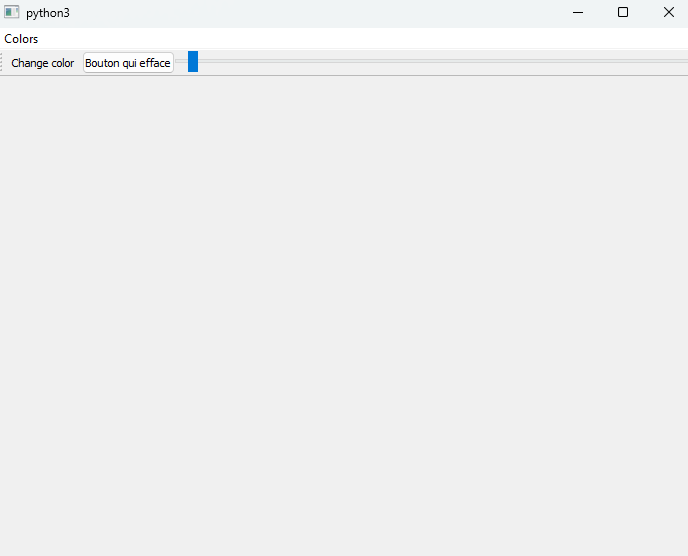
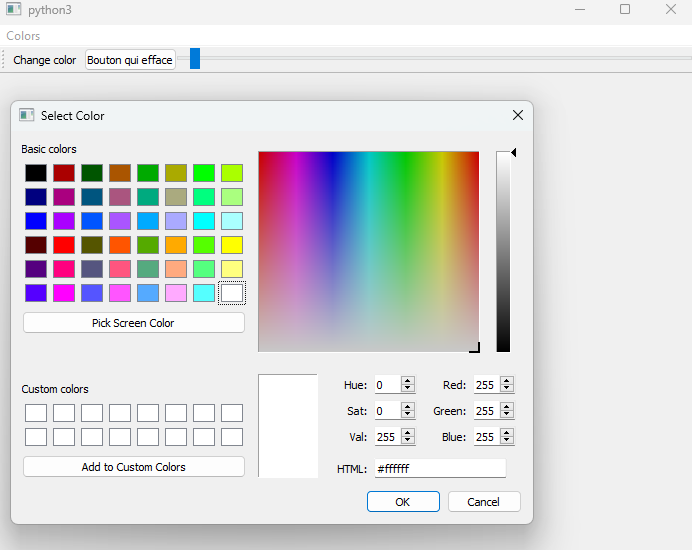
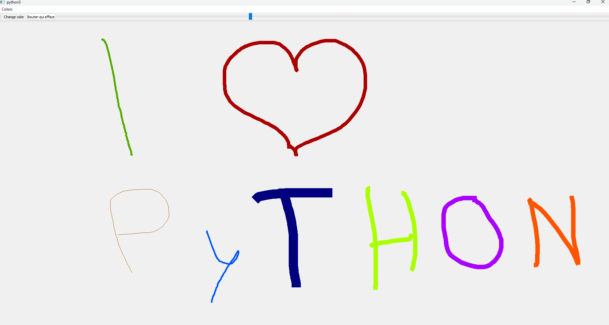

# PyDraw

Application de dession faite avec python. La taille du crayon est modifiable avec un curseur. Et il est possible de changer la couleur du crayon. Un bouton permet d'effacer tout le dessin.

# Lancement de l'application

Commande permettant de lancer l'application :  

```bash
    python Dessin.py
```

# Bibliotheque

```bash
    pip install PyQt5
```

# Visualisation

## home



## Choix de la couleur du crayon



## Exemple de dessin

